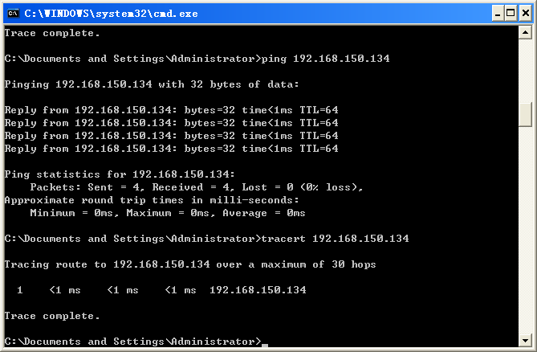

# <center><font color="#0000dd">常用的网络命令</font></center>
---

## <font color=#0099ff>实验环境</font>
* 硬件：PC、配备网卡，局域网环境。
* 平台：Windows XP操作系统。
---

## <font color=#0099ff>实验要求</font>
以下内容要求掌握:

|命令|平台|作用|
|:---:|:---:|:---:|
|[`ping`][ping]|Windows、[`Unix`][Unix]和Linux|检查网络是否连通,分析和判定网络故障|
|[`tracert`][tracert]|Windows|确定 [`IP`][IP] 数据包访问目标所采取的路径,确定从一个主机到网络上其他主机的路由|
|[`ipconfig`][ipconfig]|Windows|这是一个exe应用程序,用于显示当前的[`TCP`][TCP]/[`IP`][IP]配置的设置值|
|[`arp`][arp]||根据IP地址获取物理地址的一个[`TCP`][TCP]/[`IP`][IP]协议,用于查询本机ARP缓存中IP地址和MAC地址的对应关系、添加或删除静态对应关系等|
|[`nslookup`][nslookup]||查询 Internet域名信息或诊断[`DNS`][DNS] 服务器问题|
|[`netstat`][netstat]||显示与[`IP`][IP]、[`TCP`][TCP]、[`UDP`][UDP]和[`ICMP`][ICMP]协议相关的统计数据，一般用于检验本机各端口的网络连接情况。|
---

## <font color=#0099ff>实验内容</font>
```bash
ping  # 检查网络是否连通,分析和判定网络故障
```
* 使用ping命令ping 同桌的电脑，记录结果  

* 使用ping命令ping百度，记录结果  


```bash
tracert  # 一个简单的网络诊断工具,可以列出分组经过的路由节点,以及它在IP 网络中每一跳的延迟.(这里的延迟是指:分组从信息源发送到目的地所需的时间,延迟也分为许多的种类:传播延迟,传输延迟,处理延迟,排队延迟等,是大多数网站性能的瓶颈之一)
```
* tracert你同桌的电脑，记录结果  

* tracert新浪网  


```bash
ipconfig  # 显示当前的TCP/IP配置的设置值
```
* 执行ipconfig命令，记录ip地址、子网掩码、默认路由等信息  

* 执行ipconfig /all 命令查看所有网络连接的情况  


```bash
arp  # ARP是一个重要的TCP/IP协议，并且用于确定对应IP地址的网卡物理地址。实用arp命令，我们能够查看本地计算机或另一台计算机的ARP高速缓存中的当前内容。
```
* 使用arp命令观察自己电脑中的arp缓冲记录  

* ping实验室中某一台机器，再执行arp观察arp缓存变化  

* 使用arp命令向arp缓存中添加192.168.152.19的arp记录，故意使用错误的mca地址，然后ping 192.168.152.19  


```bash
nslookup  # nslookup命令用于查询DNS的记录，查看域名解析是否正常，在网络故障的时候用来诊断网络问题。 nslookup的用法相对来说还是蛮简单的，主要是下面的几个用法。
```
* 使用nslookup查找www.aufe.edu.cn的ip地址，记录结果  

* 使用nslookup查找www.baidu.com的ip地址，记录结果，并使用该地址（可能有多个）直接访问网站  

* 使用nslookup查找www.sina.com.cn的ip地址，记录结果，并使用ip地址访问网站  


```bash
netstat  # 检验本机各端口的网络连接情况
```
* 执行netstat命令查看本机路由表  


[ping]:https://baike.baidu.com/item/ping/6235
[Unix]:https://baike.baidu.com/item/unix
[tracert]:https://baike.baidu.com/item/%E8%B7%9F%E8%B8%AA%E8%B7%AF%E7%94%B1/8971154?fr=aladdin&fromid=7578188&fromtitle=tracert
[IP]:https://baike.baidu.com/item/IP/224599?fr=aladdin
[ipconfig]:https://baike.baidu.com/item/ipconfig
[TCP]:https://baike.baidu.com/item/TCP/33012
[arp]:https://baike.baidu.com/item/ARP/609343
[nslookup]:https://baike.baidu.com/item/nslookup
[DNS]:https://baike.baidu.com/item/dns/427444
[netstat]:https://baike.baidu.com/item/Netstat
[UDP]:https://baike.baidu.com/item/UDP
[ICMP]:https://baike.baidu.com/item/ICMP